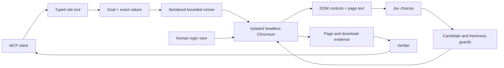

# Architecture

`spec.py` is the extension API. Site packages supply schemas and goals, not model clients or browser lifecycles. `server.py` registers them with the official low-level MCP server and adds file/custom-task tools. `runner.py` serializes calls, enforces bounds, tracks action evidence and captures, and handles completion. It never blindly repeats a failed action.

`browser.py` owns Playwright, a persistent profile lock and file lifecycle. `snapshot.js` returns observed controls and retained nodes, traversing open shadow roots. Each allowed frame has a separate snapshot. The executor rechecks the target description and uses Playwright actionability (including click visibility/occlusion). A page/target change detected before input triggers a fresh observation, at most three consecutive times. History distinguishes executed inputs from rejected preflight attempts. Failures after dispatch stop the task so a possibly committed mutation is not replayed.

`policy.py` sends one batch per step: operation plus speculative target/value/option/key questions. It consumes only the selected branch. Model predictions cannot execute code or supply new text. `done` triggers a fresh observation and either a site-specific deterministic verifier or a second model assessment.

`auth.py` uses Starlette only for the local human login page. A random capability token is passed in the URL fragment, then used as a bearer header. No model or website credentials are stored in this web UI. Chromium keeps its normal auth state in its isolated profile. The user closes login before the MCP process opens the same profile.

Persistence is per `<state>/<site>/<account>`. Files are private, downloaded names get random prefixes, caller-provided paths must resolve inside the file store, and MCP retrieval is bounded base64 chunks. Profile and download data are intentionally excluded from version control and Docker build contexts.

The framework is a trusted single-user stdio service. It is not a multi-tenant hosted browser service; adding HTTP MCP hosting would require a separate client authentication/authorization design. Website navigation allowlists and model instructions are useful boundaries but are not a network sandbox or a proof against prompt injection.
